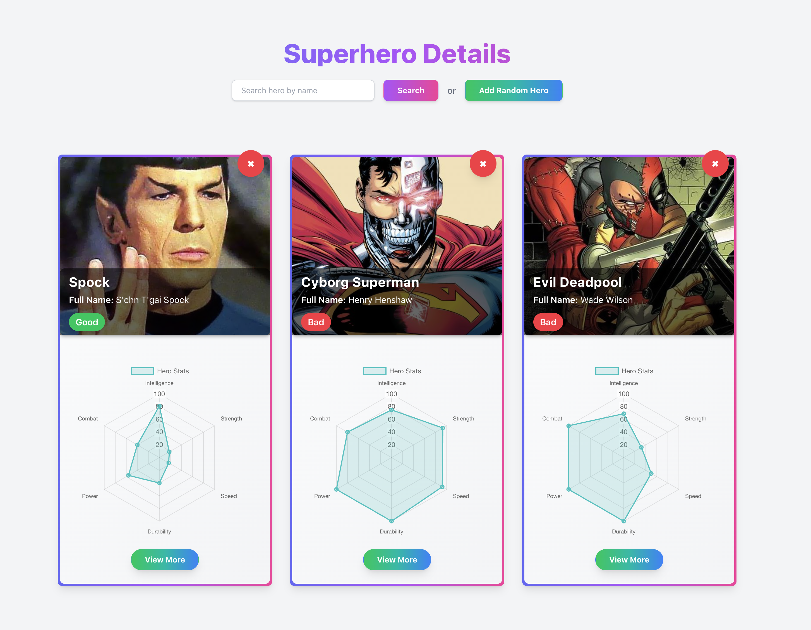
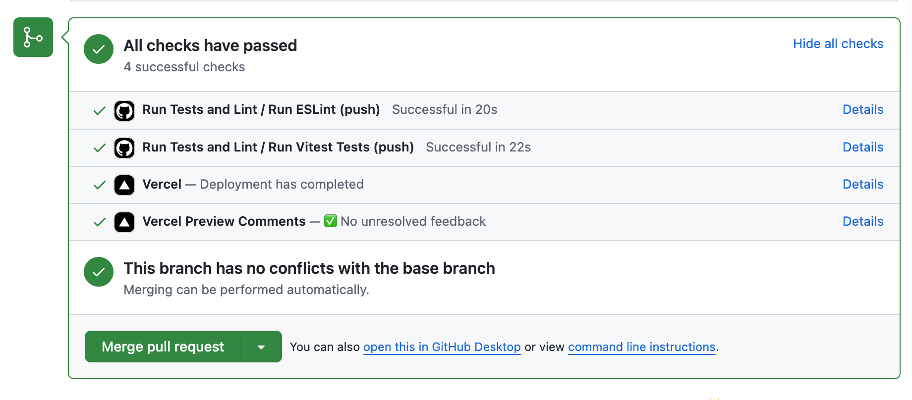
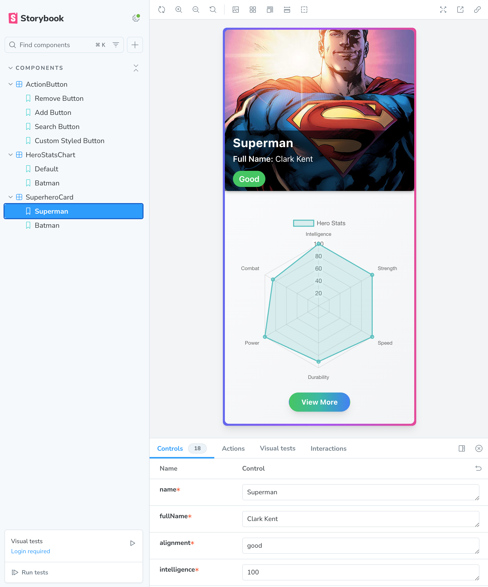

# **Herodex**

Le projet **Herodex** est déployé en ligne et accessible sur [Vercel](https://herodex-teal.vercel.app) , ou [herodex-teal.vercel.app](https://herodex-teal.vercel.app)



**Herodex** est un petit projet réalisé en une journée pour démontrer la création d’une application en suivant de bonnes pratiques de développement. Il intègre TypeScript pour un typage robuste, ESLint et Prettier pour un code propre, et des outils comme Husky, lint-staged et Commitlint pour des commits respectant les standards. L’interface utilisateur utilise React, TailwindCSS pour un design rapide, et Storybook pour documenter les composants. Les données sont gérées avec Axios et React Query, tandis que Zod valide les réponses API. Enfin, des tests automatisés avec Vitest et React Testing Library assurent la fiabilité du projet. Le déploiement est automatique, configuré avec Vercel, incluant un proxy pour gérer les requêtes API et les clés en développement comme en production, tout en respectant les politiques CORS. De plus, un workflow GitHub Actions exécute automatiquement des tests pour chaque pull request afin de garantir la qualité et la stabilité du code avant toute fusion.

### Fonctionnalités de Herodex

Herodex est un tableau de bord interactif qui permet d'explorer et de visualiser des super-héros de manière intuitive. Grâce à l’API [SuperheroAPI](https://superheroapi.com/), il est possible de rechercher des super-héros par leur ID ou leur nom. Par défaut, une carte aléatoire de super-héros est générée à l’ouverture de l’application. Vous pouvez ajouter d’autres super-héros aléatoires ou les rechercher par leur nom, et les supprimer individuellement si nécessaire. Chaque super-héros dispose d’une carte interactive qui affiche ses statistiques et des informations détaillées pour une meilleure exploration. 

## **Stack technique** 

#### Développement Frontend
- **React** : Librairie JavaScript pour construire des interfaces utilisateur interactives.
- **TypeScript** : Super-ensemble de JavaScript pour un typage statique et une meilleure maintenabilité du code.
- **TailwindCSS** : Framework CSS utilitaire pour un développement rapide et des designs modernes.
- **Storybook** : Outil pour développer et documenter les composants de manière isolée.
- **Chart.js** : Librairie puissante pour créer des graphiques interactifs et visuels.

#### Outils de Build et de Qualité
- **Vite** : Outil de build rapide et léger pour les applications web modernes.
- **ESLint** : Outil de linting pour identifier et corriger les erreurs de code.
- **Prettier** : Formateur de code pour un style de code cohérent.
- **Husky** : Outil pour ajouter des hooks Git, comme l'exécution automatique de tests ou de linting avant les commits.
- **lint-staged** : Exécute des scripts (linting, formattage) uniquement sur les fichiers modifiés.
- **Commitlint** : Vérifie que les messages de commit respectent les conventions définies.

#### Gestion de Données et API
- **Axios** : Bibliothèque pour effectuer des requêtes HTTP facilement.
- **React Query** : Gestionnaire de requêtes et de cache côté client pour des données performantes et synchronisées.
- **React Query Devtools** : Outil de développement pour inspecter et gérer les requêtes dans React Query.
- **Vercel** : Plateforme de déploiement continu utilisée pour héberger l'application, avec gestion automatique des changements à chaque commit et configuration d'un proxy pour les appels API en production.


#### Validation et Schémas
- **Zod** : Librairie de validation et de schémas TypeScript pour des données robustes.

#### Tests
- **React Testing Library** : Outil pour tester les composants React de manière efficace et fiable.
- **Vitest** : Framework de test moderne et rapide, optimisé pour Vite.
- **GitHub Actions** : Automatisation des tests avec Vitest à chaque commit et pull request. Cela permet de garantir que le code reste fonctionnel avant tout déploiement ou fusion.
---

### Complexité de Développement

L'un des aspects techniques de ce projet a été la mise en place d'un proxy fonctionnel pour Vercel, afin de gérer les requêtes vers l'API externe (superheroapi.com) de manière uniforme, que ce soit en développement local ou en production.

Cela a nécessité :

- **Modification de l'API** : Le fichier d'API a été adapté pour utiliser une URL de base configurable via `import.meta.env.VITE_API_PROXY_URL`, permettant de centraliser la gestion des requêtes vers le proxy.
- **Création d'un fichier proxy** : 
  - **`api/proxy.js`** : Ce fichier sert de point de passage entre l'application et l'API externe, incluant la gestion des erreurs et l'injection sécurisée de la clé API.
- **Configuration pour Vercel** : 
  - **`vercel.json`** : Un fichier pour définir les réécritures d'URL et les en-têtes CORS nécessaires, garantissant que les requêtes passent correctement en environnement local et en production.

Ces ajustements ont permis de gérer les contraintes liées aux politiques CORS et de simplifier l'interaction avec l'API tout en assurant la sécurité et la portabilité entre environnements.

---
## **Déploiement**

Le déploiement de l’application est entièrement automatisé grâce à **Vercel**, garantissant que chaque modification validée est mise en ligne de manière fluide. Les branches principales sont protégées, et un workflow GitHub Actions exécute automatiquement les tests avec Vitest ainsi qu’une vérification de la qualité du code avec ESLint pour chaque pull request.  Cette configuration assure que seul un code testé et validé peut être fusionné, renforçant ainsi la qualité et la stabilité du projet.


---
## **Installation**

### 1. Prérequis
- Node.js v18 ou supérieur
- npm ou yarn

### 2. Cloner le dépôt
```
git clone https://github.com/username/herodex.git
cd herodex
```

### **3. Ajouter un fichier `.env`**
Crée un fichier `.env` à la racine du projet avec le contenu suivant :

- **`VITE_SUPERHERO_API_KEY`** : Clé API nécessaire pour accéder à l’API Superhero.
  - Cette clé peut être obtenue en liant votre compte GitHub à l’API Superhero.
  - Plus d’informations sur l’API sont disponibles sur leur [site officiel](https://superheroapi.com).


### 4. Installer les dépendances
```
npm install
```

### 5. Démarrer le projet
```
npm run dev
```

Accède à l’application sur [http://localhost:5173](http://localhost:5173).

---

## **STORYBOOK**

### 1. Démarrer Storybook
```
npm run storybook
```




